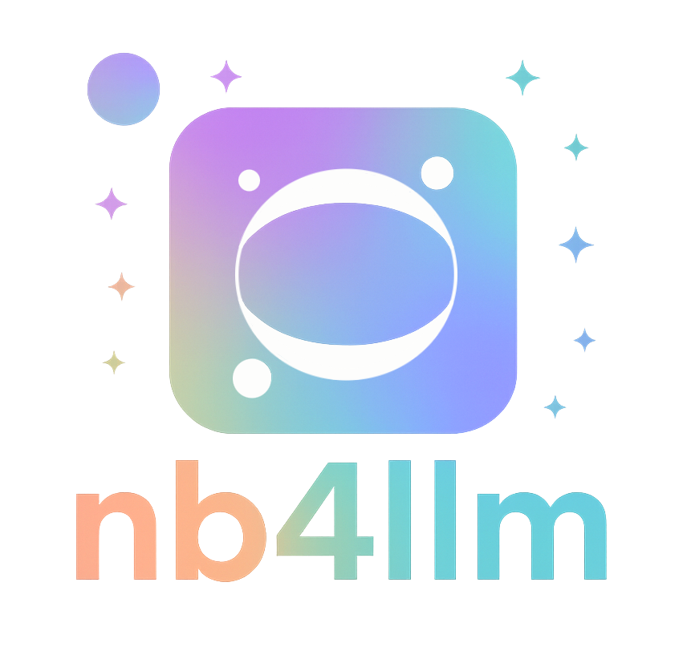

<p align="center">
  
</p>p>

[](https://pypi.org/project/nb4llm)[](https://nb4llm.readthedocs.io/en/latest/?badge=latest)[](https://github.com/Amberlee2427/nb4llm/actions/workflows/ci.yml)[](https://www.python.org/downloads/)[](https://opensource.org/licenses/MIT)

---

# `nb4llm`

**Convert Jupyter notebooks to and from a readable, LLM-friendly text format.**

## 🚀 Features

- **Convert `.ipynb` → `.txt`**: Extracts markdown and code cells as readable, chunked blocks.
- **Convert `.txt` → `.ipynb`**: Reconstructs a notebook from the text format.
- **Language-aware**: Preserves code cell language (Python, R, Julia, etc).
- **Robust chunking**: Handles nested code fences and markdown.
- **CLI tool**: Easy to use from the command line or scripts.
- **Pre-commit, Black, isort, flake8**: Modern Python dev workflow.

---

## 📦 Installation

```bash
pip install -e .
# or, for development:
pip install -e .[dev]
```

---

## 📝 Usage

### **Convert a notebook to text**

```bash
nb4llm notebook.ipynb
# Output: notebook.txt
```

### **Convert a notebook to a specific text file**

```bash
nb4llm notebook.ipynb output.txt
```

### **Convert text back to a notebook**

```bash
nb4llm --reverse notebook.txt
# Output: notebook.ipynb
```

### **Convert text to a specific notebook file**

```bash
nb4llm --reverse notebook.txt output.ipynb
```

### **Show help**

```bash
nb4llm --help
```

---

## 🧑‍💻 Example Text Format

```
# my_notebook.ipynb

```markdown
Some markdown text
```

```python
# Some code
print(\"Hello, world!\")
```
```

---

## 🛠️ Development

### **Run tests**

```bash
pytest tests/
```

### **Run formatting and linting**

```bash
pre-commit run --all-files
```

### **Type checking**

```bash
mypy src/
```

---

## 🧩 Project Structure

```
nb4llm/
├── src/
│   └── nb4llm/
│       ├── __init__.py
│       ├── cli.py
│       └── converter.py
├── tests/
│   ├── test_cli.py
│   ├── test_converter.py
│   └── conftest.py
├── pyproject.toml
├── .pre-commit-config.yaml
├── .flake8
└── README.md
```

---

## 📝 Contributing

1. Fork the repo and create a feature branch.
2. Make your changes and add tests.
3. Run `pre-commit run --all-files` and `pytest`.
4. Submit a pull request!

---

## 📄 License

MIT License. See [LICENSE](LICENSE) for details.

---

**Built for robust, LLM-friendly notebook processing.**

---

Let me know if you want this written to your `README.md` or want to tweak any section!


## Contact

name: Amber Malpas 
github: AmberLee2427
email: malpas.1@osu.edu
